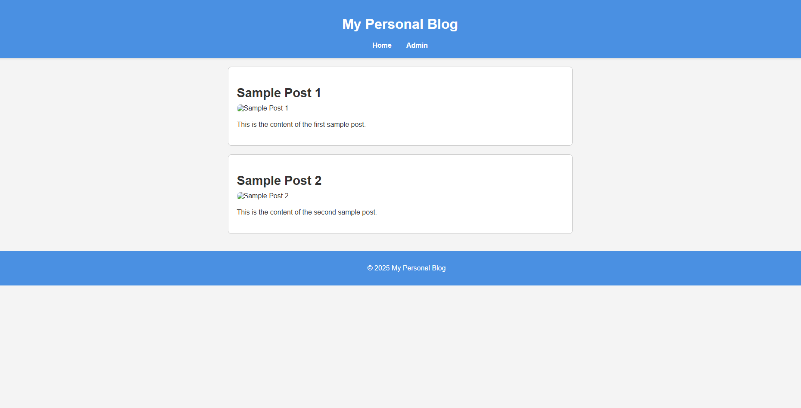

<h2>My Personal Blog</h2>

This is a simple personal blog built using HTML, CSS, and JavaScript, with a backend server implemented in Node.js. Users can view blog posts and access an admin panel for managing content.

<h3>Features</h3>
<ul>
    <li>User-friendly interface for reading blog posts</li>
    <li>Admin panel for managing blog content</li>
    <li>Dynamic loading of posts</li>
    <li>Responsive design for various screen sizes</li>
</ul>

<h3>View the Screenshot</h3>

    

<h3>How to Use</h3>
<ol>
    <li>Open a terminal and navigate to the project directory.</li>
    <li>Run the command <code>npm start</code> to start the server.</li>
    <li>Open your web browser and go to <a href="http://localhost:3000">http://localhost:3000</a> to view the blog.</li>
    <li>Access the admin panel to manage blog posts.</li>
</ol>

<h3>Getting Started</h3>

To run this project locally:

<ol>
    <li>Clone the repository:</li>
    <pre><code>git clone https://github.com/anonymByte-404/personal-blog.git
cd personal-blog</code></pre>
    <li>Install the dependencies:</li>
    <pre><code>npm install</code></pre>
    <li>Start the server:</li>
    <pre><code>npm start</code></pre>
</ol>

<h3>Contribution</h3>

Feel free to contribute to this project by submitting issues or pull requests. Any suggestions for improvements are welcome!

