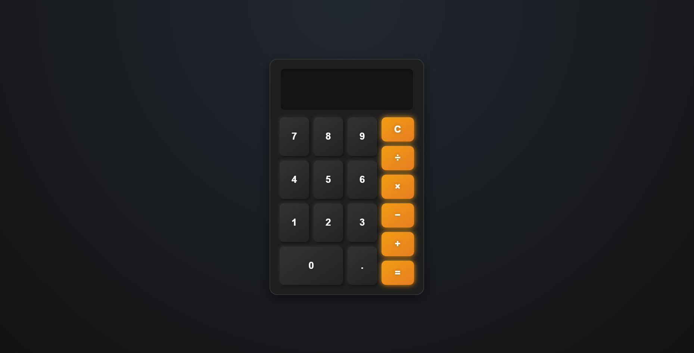

<h2>🖩 Calculator</h2>

    This is a <strong>simple web-based calculator</strong> built using <strong>HTML, CSS, and JavaScript</strong>. It allows users to perform basic arithmetic operations, including <strong>addition, subtraction, multiplication, and division</strong>.

<h3>✨ Features</h3>
<ul>
    <li>📱 <strong>User-friendly interface</strong> with a sleek dark theme</li>
    <li>➕➖✖️➗ Supports basic arithmetic operations</li>
    <li>🧹 <strong>Clear button</strong> to reset the display</li>
    <li>✅ <strong>Instant calculation</strong> when the equals button is pressed</li>
</ul>

<h3>📸 Screenshot</h3>

    

<h3>📹 Video Preview</h3>

    <video width="100%" controls loop>
        <source src="./assets/videos/live-preview.mp4" type="video/mp4">
        Your browser does not support the video tag.
    </video>

<h3>📖 How to Use</h3>
<ol>
    <li>Open the <code>index.html</code> file in your web browser.</li>
    <li>Use the <strong>number buttons</strong> to enter the desired numbers.</li>
    <li>Click an <strong>operation button</strong> (+, -, ×, ÷) to perform calculations.</li>
    <li>Press the <strong>C button</strong> to reset the display.</li>
    <li>Press the <strong>= button</strong> to see the result of the calculation.</li>
</ol>

<h3>🚀 Getting Started</h3>

To run this project locally:

<ol>
    <li>Clone the repository:</li>
    <pre><code>git clone https://github.com/anonymByte-404/html-projects.git
cd html-projects/beginner-projects/calculator</code></pre>
    <li>Open the <code>index.html</code> file in your preferred web browser.</li>
</ol>

<h3>🤝 Contribution</h3>

    Contributions are always welcome! If you have ideas for <strong>improving the UI, adding features, or fixing bugs</strong>, feel free to submit an issue or a pull request.

