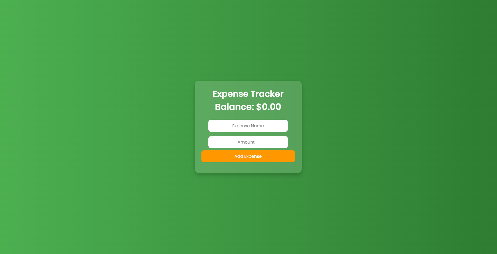

<h2>Expense Tracker</h2>

This is a simple web-based expense tracker application built using HTML, CSS, and JavaScript. It allows users to manage their expenses by adding and tracking various transactions, providing a clear overview of their financial balance.

<h3>Features</h3>
<ul>
    <li>User-friendly interface for adding expenses</li>
    <li>Displays the current balance based on added expenses</li>
    <li>Real-time updates to the expense list and balance</li>
    <li>Input fields for expense name and amount</li>
    <li>Clear layout for easy navigation</li>
</ul>

<h3>View the Screenshot</h3>

    

<h3>How to Use</h3>
<ol>
    <li>Clone the repository or download the files:</li>
    <pre><code>git clone https://github.com/anonymByte-404/html-projects.git
cd html-projects/expense-tracker</code></pre>
    <li>Open the <code>index.html</code> file in your web browser to start tracking your expenses.</li>
    <li>Enter the name and amount of the expense in the input fields.</li>
    <li>Click the <strong>Add Expense</strong> button to add the expense to your list.</li>
</ol>

<h3>Getting Started</h3>

This expense tracker can be easily integrated into your web projects:

<ol>
    <li>Copy the HTML structure into your project.</li>
    <li>Link the CSS file to apply the styles.</li>
    <li>Implement the JavaScript functionality to handle adding expenses and updating the balance.</li>
</ol>

<h3>Contribution</h3>

Feel free to contribute to this project by submitting issues or pull requests. Suggestions for improvements or additional features are welcome!

