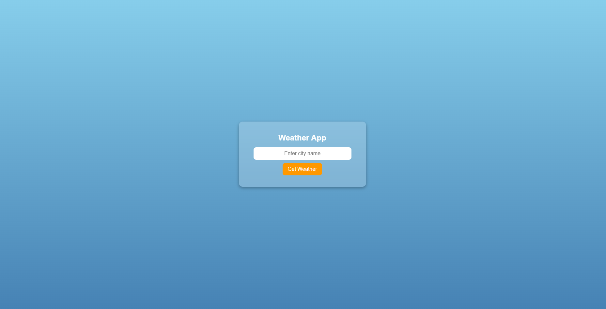

<h2>Weather App</h2>

This is a simple web-based weather application built using HTML, CSS, and JavaScript. It allows users to enter a city name and fetch the current weather information, providing a quick and easy way to check the weather.

<h3>Features</h3>
<ul>
    <li>User-friendly interface for entering city names</li>
    <li>Displays current weather information, including temperature and conditions</li>
    <li>Real-time updates based on user input</li>
    <li>Clear and responsive layout for easy navigation</li>
</ul>

<h3>View the Screenshot</h3>

    

<h3>How to Use</h3>
<ol>
    <li>Clone the repository or download the files:</li>
    <pre><code>git clone https://github.com/anonymByte-404/html-projects.git
cd html-projects/weather-app</code></pre>
    <li>Open the <code>index.html</code> file in your web browser to start checking the weather.</li>
    <li>Enter the name of a city in the input field.</li>
    <li>Click the <strong>Get Weather</strong> button to fetch the current weather information for the entered city.</li>
</ol>

<h3>Getting Started</h3>

This weather app can be easily integrated into your web projects:

<ol>
    <li>Copy the HTML structure into your project.</li>
    <li>Link the CSS file to apply the styles.</li>
    <li>Implement the JavaScript functionality to handle fetching weather data from an API.</li>
</ol>

<h3>Contribution</h3>

Feel free to contribute to this project by submitting issues or pull requests. Suggestions for improvements or additional features are welcome!

