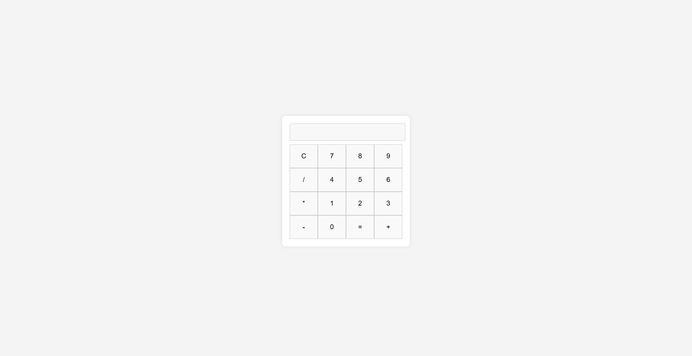

<h2>Calculator</h2>

This is a simple web-based calculator built using HTML, CSS, and JavaScript. It allows users to perform basic arithmetic operations such as addition, subtraction, multiplication, and division.

<h3>Features</h3>
<ul>
    <li>User-friendly interface</li>
    <li>Supports basic arithmetic operations: addition, subtraction, multiplication, and division</li>
    <li>Clear button to reset the display</li>
    <li>Calculates the result when the equals button is pressed</li>
</ul>

<h3>View the Screenshot</h3>

    

<h3>How to Use</h3>
<ol>
    <li>Open the <code>index.html</code> file in your web browser.</li>
    <li>Use the number buttons to enter the desired numbers.</li>
    <li>Click on the arithmetic operation buttons (+, -, *, /) to perform calculations.</li>
    <li>Press the <code>C</code> button to clear the current input.</li>
    <li>Press the <code>=</code> button to see the result of the calculation.</li>
</ol>

<h3>Getting Started</h3>

To run this project locally:

<ol>
    <li>Clone the repository:</li>
    <pre><code>git clone https://github.com/anonymByte-404/html-projects.git
cd html-projects/calculator</code></pre>
    <li>Open the <code>index.html</code> file in your preferred web browser.</li>
</ol>

<h3>Contribution</h3>

Feel free to contribute to this project by submitting issues or pull requests. Any suggestions for improvements are welcome!

