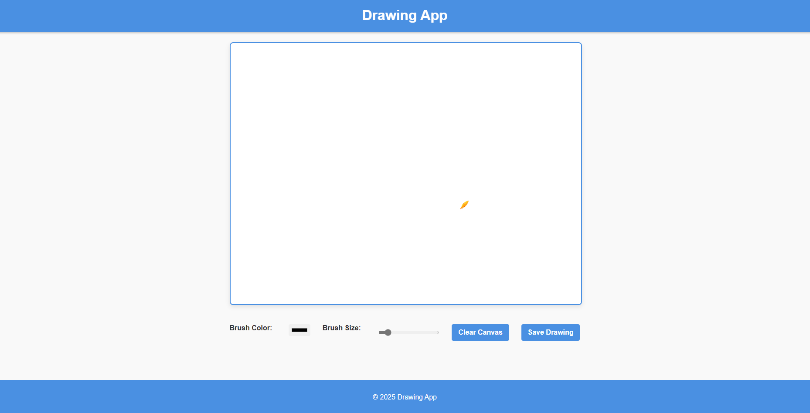

<h2>Drawing App</h2>

This is a simple web-based drawing application built using HTML, CSS, and JavaScript. It allows users to create drawings on a canvas using different brush colors and sizes.

<h3>Features</h3>
<ul>
    <li>User-friendly interface for drawing</li>
    <li>Customizable brush color and size</li>
    <li>Clear canvas button to reset the drawing</li>
    <li>Save drawing functionality</li>
</ul>

<h3>View the Screenshot</h3>

    

<h3>How to Use</h3>
<ol>
    <li>Open the <code>index.html</code> file in your web browser.</li>
    <li>Select a brush color using the color picker.</li>
    <li>Adjust the brush size using the range slider.</li>
    <li>Click and drag on the canvas to create your drawing.</li>
    <li>Press the <code>Clear Canvas</code> button to reset the drawing.</li>
    <li>Press the <code>Save Drawing</code> button to save your artwork.</li>
</ol>

<h3>Getting Started</h3>

To run this project locally:

<ol>
    <li>Clone the repository:</li>
    <pre><code>git clone https://github.com/anonymByte-404/drawing-app.git
cd drawing-app</code></pre>
    <li>Open the <code>index.html</code> file in your preferred web browser.</li>
</ol>

<h3>Contribution</h3>

Feel free to contribute to this project by submitting issues or pull requests. Any suggestions for improvements are welcome!

