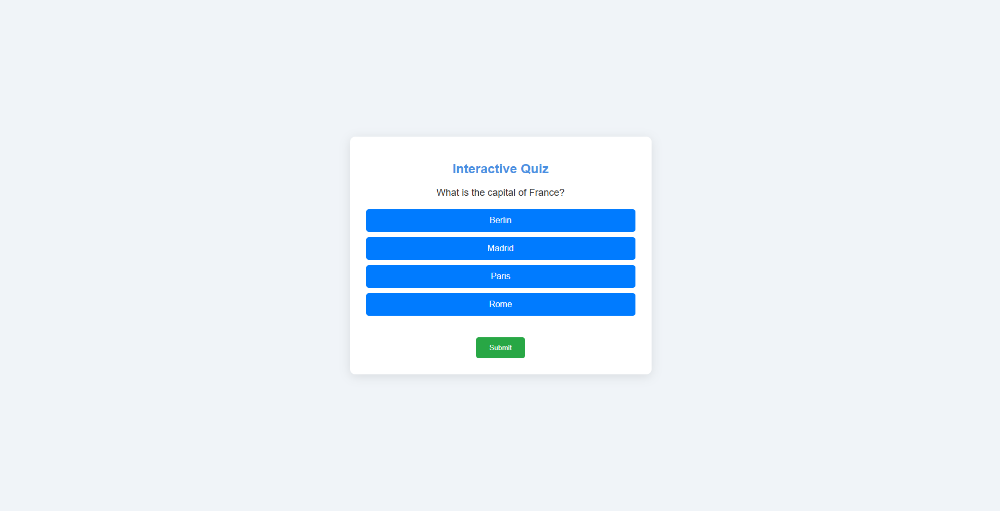

<h2>Interactive Quiz App</h2>

This is a web-based interactive quiz application built using HTML, CSS, and JavaScript. It allows users to test their knowledge on various topics by answering multiple-choice questions.

<h3>Features</h3>
<ul>
    <li>User-friendly interface for answering quiz questions</li>
    <li>Dynamic question loading with multiple-choice options</li>
    <li>Score display at the end of the quiz</li>
    <li>Option to restart the quiz</li>
</ul>

<h3>View the Screenshot</h3>

    

<h3>How to Use</h3>
<ol>
    <li>Open the <code>index.html</code> file in your web browser.</li>
    <li>Read the question displayed on the screen.</li>
    <li>Select your answer from the multiple-choice options.</li>
    <li>Click the <code>Submit</code> button to submit your answer.</li>
    <li>After completing the quiz, your score will be displayed.</li>
    <li>Click the <code>Restart Quiz</code> button to take the quiz again.</li>
</ol>

<h3>Getting Started</h3>

To run this project locally:

<ol>
    <li>Clone the repository:</li>
    <pre><code>git clone https://github.com/anonymByte-404/interactive-quiz-app.git
cd interactive-quiz-app</code></pre>
    <li>Open the <code>index.html</code> file in your preferred web browser.</li>
</ol>

<h3>Contribution</h3>

Feel free to contribute to this project by submitting issues or pull requests. Any suggestions for improvements are welcome!

