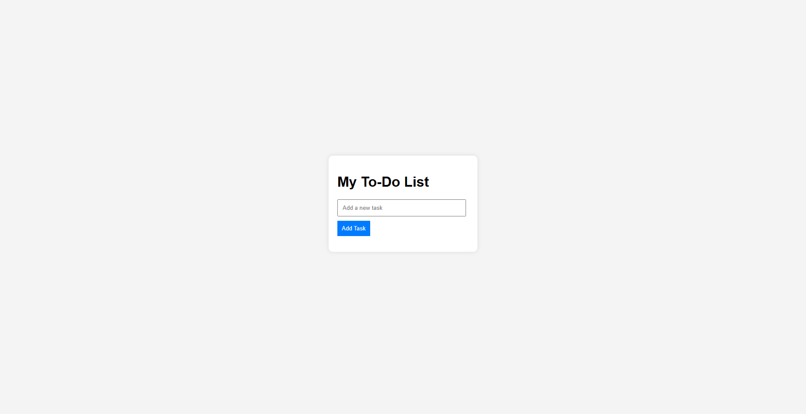

<h2>To-Do List</h2>

This is a basic to-do list application built with HTML, CSS, and JavaScript. It allows users to manage tasks effectively by adding, completing, and removing tasks.

<h3>Features</h3>
<ul>
    <li>User-friendly interface</li>
    <li>Add new tasks to the list</li>
    <li>Mark tasks as completed by clicking on them</li>
    <li>Remove tasks from the list</li>
</ul>

<h3>View the Screenshot</h3>

    

<h3>How to Use</h3>
<ol>
    <li>Open the <code>index.html</code> file in your web browser.</li>
    <li>Enter a new task in the input field.</li>
    <li>Click the "Add Task" button to add the task to the list.</li>
    <li>Click on a task to mark it as completed.</li>
    <li>Click on the completed task again to remove it from the list.</li>
</ol>

<h3>Getting Started</h3>

To run this project locally:

<ol>
    <li>Clone the repository:</li>
    <pre><code>git clone https://github.com/anonymByte-404/html-projects.git
cd html-projects/todolist</code></pre>
    <li>Open the <code>index.html</code> file in your preferred web browser.</li>
</ol>

<h3>Contribution</h3>

Feel free to contribute to this project by submitting issues or pull requests. Any suggestions for improvements are welcome!

