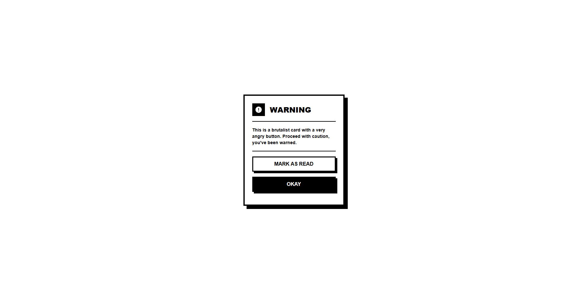

<h1>Brutalist Card</h1>

<h2>Description</h2>

The <strong>Brutalist Card</strong> is a simple web component designed with a brutalist aesthetic. It features a warning message and two action buttons, styled with CSS to create a unique and eye-catching design. This project showcases how to create a card layout using HTML and CSS, emphasizing a bold and functional user interface.

<h2>Preview</h2>

    

<h2>Getting Started</h2>

<h3>Prerequisites</h3>

<ul>
    <li>A modern web browser</li>
    <li>Basic knowledge of HTML and CSS</li>
</ul>

<h3>Installation</h3>

<ol>
    <li>Clone the repository:
        <pre><code>git clone https://github.com/anonymByte-404/html-projects.git
cd html-projects/ui-components/cards/warning-card
</code></pre>
    </li>
    <li>Open the <code>index.html</code> file in your web browser.</li>
</ol>

<h3>Usage</h3>

<ul>
    <li>The card displays a warning message and two buttons: "Mark as Read" and "Okay."</li>
    <li>Customize the message and actions as needed by editing the HTML.</li>
</ul>

<h3>Customization</h3>

Feel free to modify the styles in <code>styles.css</code> to match your preferred aesthetic. You can change colors, sizes, and layouts to create a unique look.

<h2>Contributing</h2>

Contributions are welcome! If you have suggestions or improvements, please submit a pull request.

<h2>License</h2>

This project is open-source and available under the <a href="../../../LICENSE">MIT License</a>.
