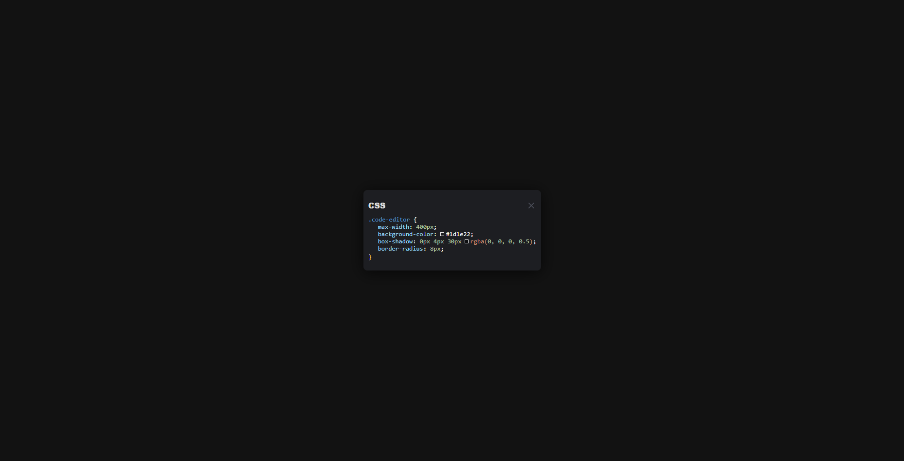

<h1>CSS Code Editor</h1>

This is a simple and interactive CSS code editor designed with a modern dark theme. It allows users to view and edit CSS code snippets in a visually appealing environment. The editor is lightweight and responsive, making it suitable for various screen sizes.

<h2>Features</h2>
<ul>
    <li>Dark theme for comfortable viewing</li>
    <li>Interactive code highlighting</li>
    <li>Responsive design</li>
    <li>Hover effects for improved usability</li>
    <li>Simple close functionality (can be expanded)</li>
</ul>

<h2>Screenshot</h2>

  
*CSS Code Editor showcasing a sample CSS code snippet.*

<h2>Live Preview</h2>

    <video width="100%" controls loop>
        <source src="./assets/videos/live-preview.mp4" type="video/mp4">
        Your browser does not support the video tag.
    </video>

<h2>Installation</h2>

To run this project locally, follow these steps:

<ol>
    <li>Clone the repository:
        <pre><code>git clone https://github.com/yourusername/css-code-editor.git
cd css-code-editor</code></pre>
    </li>
    <li>Open the <code>index.html</code> file in your preferred web browser.</li>
</ol>

<h2>Usage</h2>
<ol>
    <li>Open the <code>index.html</code> file in a web browser.</li>
    <li>You can view the CSS code snippets in the editor.</li>
    <li>Hover over the properties to see interactive effects.</li>
    <li>Click the close icon to simulate closing the editor (currently, it shows an alert).</li>
</ol>

<h2>Contributing</h2>

If you would like to contribute to this project, please fork the repository and create a pull request. Any improvements or suggestions are welcome!

<h2>License</h2>

This project is licensed under the MIT License. See the <a href="../../../LICENSE">LICENSE</a> file for more information.

