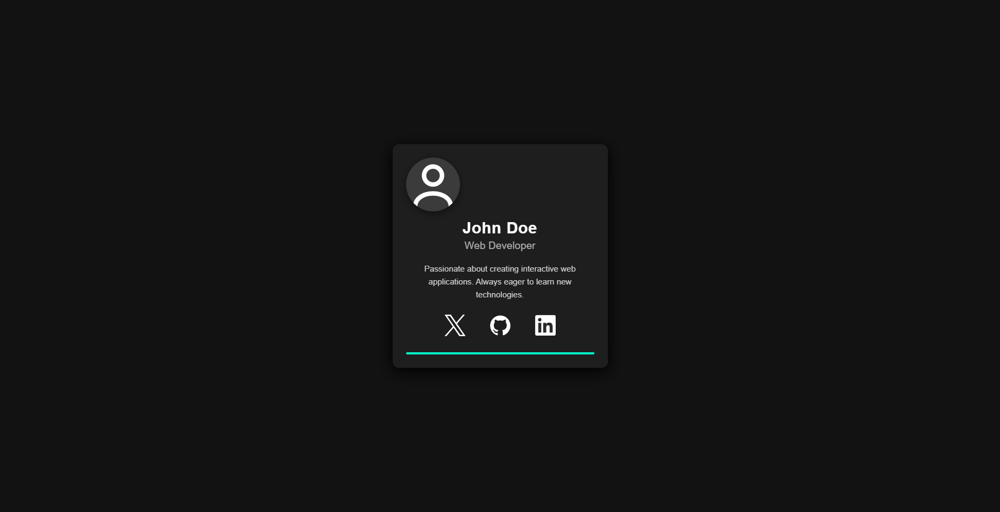

<h1 align="center">Profile Card Project</h1>

  A modern, animated profile card with hover effects and social media links.

<h2>✨ Features</h2>

<ul>
  <li>Clean, dark-themed design</li>
  <li>Smooth hover animations</li>
  <li>Interactive social media icons</li>
  <li>Responsive layout</li>
  <li>SVG-based icons</li>
  <li>CSS transitions and transforms</li>
</ul>

<h2>📸 Screenshot Section</h2>

  
   

<h2>🌐 Live Preview</h2>

    <video width="100%" controls loop>
        <source src="./assets/videos/live-preview.mp4" type="video/mp4">
        Your browser does not support the video tag.
    </video>

<h2>🛠 Technologies Used</h2>

<ul>
  <li>HTML5</li>
  <li>CSS3 (with animations and transitions)</li>
  <li>SVG icons</li>
</ul>

<h2>⚙️ Installation</h2>

No installation required - just open <code>index.html</code> in your browser.

<h2>🎨 Customization</h2>

To customize the profile card:

<ol>
  <li>Edit the <code>index.html</code> file to change:
    <ul>
      <li>Name in <code>&lt;h2 class="name"&gt;</code></li>
      <li>Title in <code>&lt;p class="title"&gt;</code></li>
      <li>Bio text in <code>&lt;p class="bio"&gt;</code></li>
      <li>Social media links in the <code>&lt;a href=""&gt;</code> tags</li>
    </ul>
  </li>
  <li>Modify <code>styles.css</code> to change:
    <ul>
      <li>Colors in the various CSS variables</li>
      <li>Animation timings</li>
      <li>Card dimensions</li>
    </ul>
  </li>
</ol>

<h2>🖱 Hover Effects</h2>

The card includes several interactive hover effects:

<ul>
  <li>Card lifts and grows slightly</li>
  <li>Profile icon pulses with a glow effect</li>
  <li>Name and title change color</li>
  <li>Social media icons scale up and change color</li>
  <li>Subtle background color change on card hover</li>
</ul>

<h2>🌍 Browser Support</h2>

The profile card should work in all modern browsers including:

<ul>
  <li>Chrome</li>
  <li>Firefox</li>
  <li>Safari</li>
  <li>Edge</li>
</ul>

<h2>📜 License</h2>

This project is open source and available under the <a href="../../../LICENSE">MIT License</a>.
