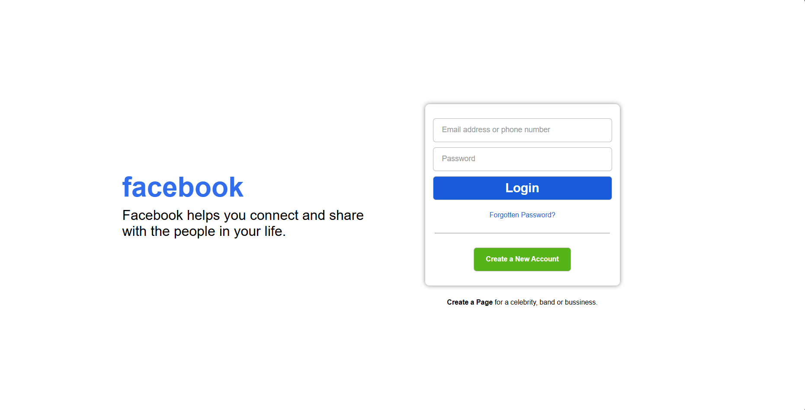

<h2>Facebook Login Page Clone</h2>

This is a simple Facebook login page clone designed using HTML and CSS. It mimics the login interface of Facebook, providing a modern and responsive layout.

<h3>Features</h3>
<ul>
    <li>Responsive design that adapts to different screen sizes</li>
    <li>Styled input fields for better user experience</li>
    <li>Login and account creation buttons</li>
    <li>Link for password recovery</li>
    <li>Minimalistic and clean layout</li>
</ul>

<h3>View the Screenshot</h3>

    

<h3>How to Use</h3>
<ol>
    <li>Clone the repository or download the files:</li>
    <pre><code>git clone https://github.com/anonymByte-404/html-projects.git
cd html-projects/facebook-login</code></pre>
    <li>Open the <code>index.html</code> file in your web browser to view the page.</li>
    <li>Customize the styles in <code>styles.css</code> as needed.</li>
</ol>

<h3>Getting Started</h3>

This template can be easily customized for your projects:

<ol>
    <li>Modify the HTML structure to fit your needs.</li>
    <li>Edit the CSS file to adjust the styles.</li>
    <li>Add JavaScript functionality if required.</li>
</ol>

<h3>Contribution</h3>

Feel free to contribute by submitting issues or pull requests. Any improvements or suggestions are welcome!

