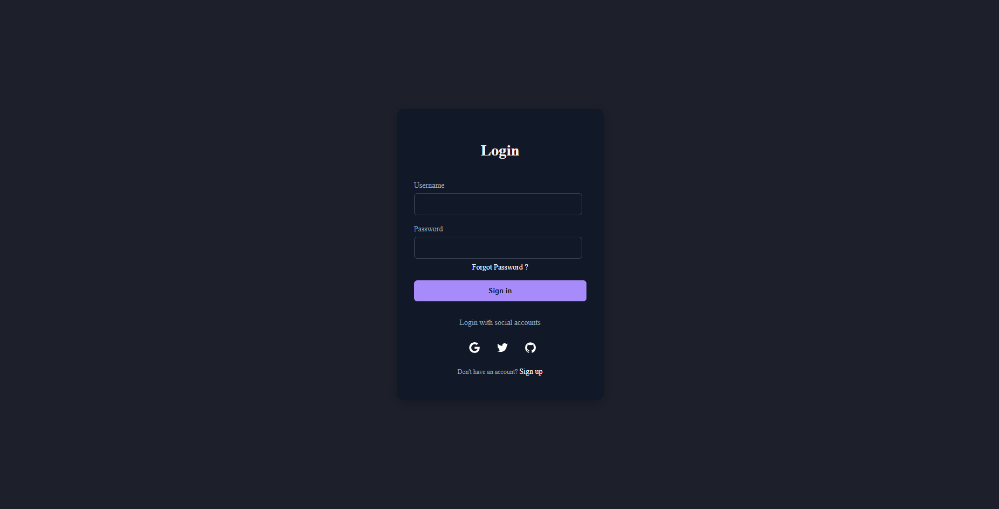

<h2>Simple Form Template</h2>

This is a simple form template designed with a modern user interface using HTML and CSS. It serves as a starting point for creating user input forms in web applications, allowing for easy customization and integration into larger projects.

<h3>Features</h3>
<ul>
    <li>Responsive design that adapts to different screen sizes</li>
    <li>Styled input fields for improved user experience</li>
    <li>Includes labels and placeholders for better usability</li>
    <li>Submit button to trigger form actions</li>
    <li>Minimalistic and clean layout</li>
</ul>

<h3>View the Screenshot</h3>

    

<h3>How to Use</h3>
<ol>
    <li>Clone the repository or download the files:</li>
    <pre><code>git clone https://github.com/anonymByte-404/html-projects.git
cd html-projects/simple-form</code></pre>
    <li>Open the <code>index.html</code> file in your web browser to see the form in action.</li>
    <li>Customize the form fields, labels, and styles as needed for your application.</li>
</ol>

<h3>Getting Started</h3>

This template can be easily integrated into your web projects:

<ol>
    <li>Copy the HTML structure into your project.</li>
    <li>Link the CSS file to apply the styles.</li>
    <li>Modify the form actions and input types according to your requirements.</li>
</ol>

<h3>Contribution</h3>

Feel free to contribute to this project by submitting issues or pull requests. Suggestions for improvements or additional features are welcome!

